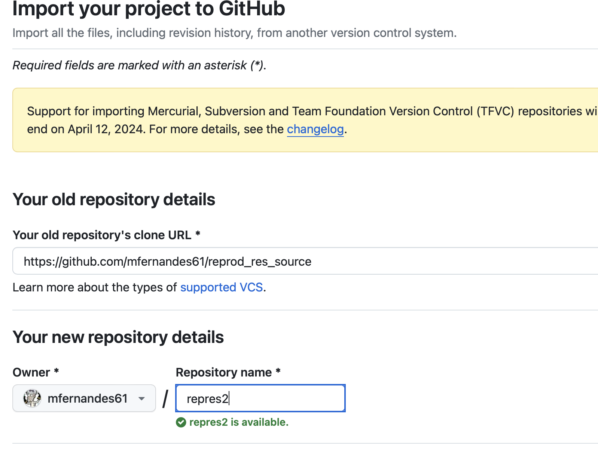

# reprod_res_source
A deliberately misspelt version of [this BTF page](https://bioinfotraining.bio.cam.ac.uk/about-facility) 
for use as a Github teaching Exercise. The misspelt version used this 
[utility](https://www.online-utility.org/text/misspellizer.jsp).  
Additionally, as an alternative document for editting - a RMarkdown R program in severe need of some 
explanatory Markdown documentation.   

Students should "Clone" this repository and then give access to the copy to students for branch exercise,    
Later you will revoke permissions to let them work on a fork of the repository.
(Follow the instructions below).   

__Instructions on making your own copy of this repository__
1. Click in the URL bar of your browser and copy the URL of this repository.   

2. Go to your initial Github page and click on the "+" at the top RH corner.    

3. Choose Import repository and paste in the URL from step 1. Give the new repository a memorable    
name (You will be sharing this with your study partner for the branching & forking exercises.         

4. Click on the green Import button and after a short wait you will have a new respository in your repository list.    

   
5. For the branching exercise you will need to make your study partner a collaborator to give
them the ability to edit your repository document Click on the settings cogon top RH corner of the repository.

   
6. Now click on collaborators (Under General(.      

    
7. You will now need to authenticate as you are changing access to one of your repositories (Here we use the "Github Mobile" app.   

   
8. Choose to add people.   

    
9. Search for your study partners github ID and select them.    

